# 织造司 WMS 与 PDA 产品需求文档

- **文档日期：** 2026-09-21
- **范围：** 当前已可演示的 WMS 后台与 PDA。行为以页面和 `wms/shared/js/flow.js` 为准。
- **演示：** https://xixueting-my.github.io/zhizaosi-wms/
- **说明：** 成功标准里，凡是还没有线上统计的指标，都标成「待上线后统计」。本文件描述的是这一版产品该怎么用，不是整套跨境 ERP。

## 1. 概述

**要解决的问题：** 仓库收货、质检、上架、配货、复核如果只写在纸上或各记各的表，同一件货的唯一码对不上，后台和手持看到的数量会分叉。

**这一版怎么做：** WMS 后台管单据和主数据，PDA 负责扫码作业。两边读写同一份单据和唯一码。工人在 PDA 上做到哪一步，后台列表的状态就变成哪一步。

**做成的标准：**

1. 同一浏览器打开 WMS 与 PDA，完成「到货 → 收货 → 质检合格 → 上架」后，收货单为「全部收货」，入库单为「已入库」，上架任务为「已上架」，件数与唯一码条数一致。
2. 配货单全部扫完并提交后，多件单进入「待分拣」再提交才到「已配货」；关联订单进入「待复核」。PDA 复核扫码后，订单进入「已复核」。
3. 未到货的收货单不能收货。未收货的唯一码不能质检。非合格件不能上架。
4. 唯一码格式为 `站点||SPU||色系||尺码-序号`。同一 SKU 的序号从 1 起。
5. 待上线后统计：一单从到货到上架的作业中断次数、扫错码率。当前演示版不采集这两项。

## 2. 谁在用、要完成什么

**仓管（WMS 后台）**  
看收货单、入库单、上架任务、订单、波次、配货单、盘点、移位和库存。到货、逐件收货、逐件质检、逐件上架、逐件配货和复核不在后台按钮里完成。

**仓内作业员（PDA）**  
登录后选择仓库，按岗位做扫码。账号演示为 `pda` / `pda123`，默认仓为杭州一号仓。

**主数据管理员**  
在「基础数据管理」维护仓库、库位、站点。其他模块使用这里的仓库名和库位，不在业务页写死仓名。

### 用户故事与完成定义

**到货**  
作为作业员，我要扫描收货单并确认到货，这样后台才允许收货。

- 未到货的单，PDA 列表操作是「去确认」，WMS 操作列是「待 PDA 到货」。
- 确认后写入到货时间和到货人。重复确认提示「该单已到货确认」。
- 已收完或作废的单不能再到货。

**收货**  
作为作业员，我要按唯一码把本单件数扫入并提交，这样实收件数等于扫过的件数。

- 必须先有到货时间。
- 扫描写入本次会话，提交后才增加实收，唯一码变为「已收」。
- 实收少于送货件数时，必须填写原因，状态为「部分收货」。
- 实收等于送货件数时，状态为「全部收货」。
- 扫到其他收货单的唯一码、或重复扫描，操作失败并给出中文原因。

**质检**  
作为质检员，我要逐件判定合格、不合格或仓内维修，这样只有合格件能上架。

- 未收货的唯一码不能质检。
- 不合格、仓内维修必须选择原因。
- 仍有「已收未质检」的件数时，不能提交本单质检。
- 提交后入库单变为「质检完成」，并生成上架任务。

**上架**  
作为上架员，我要先扫合格唯一码，再扫库位，这样这件货落到具体库位。

- 只有状态为「质检合格」的唯一码可以上架。
- 成功后唯一码状态为「已上架」，并记下库位。
- 上架任务按计划件数与完成件数变为「待上架 / 部分上架 / 已上架」。

**配货与复核**  
作为配货员，我要按配货单扫唯一码或 SKU；作为复核员，我要对待复核订单扫唯一码。

- 配货、缺货由 PDA 回写。后台只分配配货员，不提供「拣货完成 / 缺货 / 取消」。
- 一行扫满后不能再扫该行。
- 全部扫完提交：单件配货单直接「已配货」；多件配货单先「待分拣」，再提交才「已配货」。
- 配货单变为「已配货」时，关联的待出库订单变为「待复核」。
- 复核扫描达到订单数量后，订单为「已复核」，唯一码为「已复核」。

**库位查询与打印唯一码**  
作为作业员，我扫 SKU 要看到各库位数量；扫唯一码要看到当前库位和状态。锁定库位后每扫一个 SKU，生成并打印一个新唯一码，序号在该 SKU 上加 1。

### 明确不做

- 不做 PLM、打版、采购生产、Shopify 真实拉单。演示里的「模拟 MES 发货」「模拟 OMS 下发」只生成单据。
- WMS 不做「到货扫描、反收货、作废」。
- WMS 不做配货完成、缺货、取消。这些只在 PDA。
- 波次单管理不分状态页签。
- 不做多货主、海外仓真实履约、蓝牙打印机驱动。打印在演示里给出唯一码结果。
- 演示数据存在当前浏览器，不在多台设备之间同步。

## 3. 主流程

作业员和仓管看的是同一条链路。实线是工人在 PDA 上的动作，后台只展示结果。

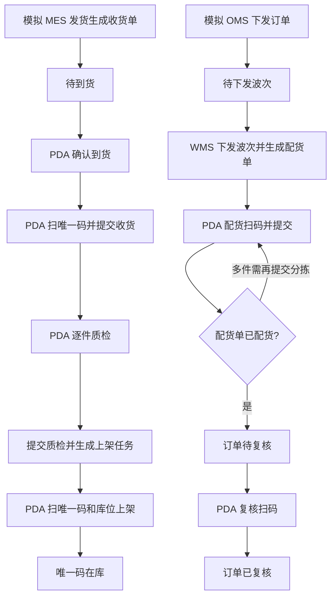

### PDA 进入方式

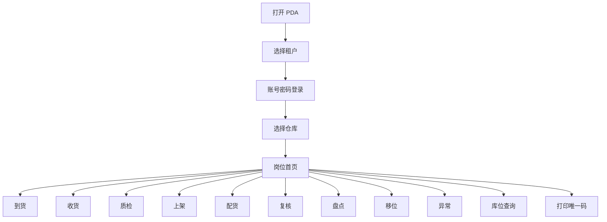

### 收货扫码

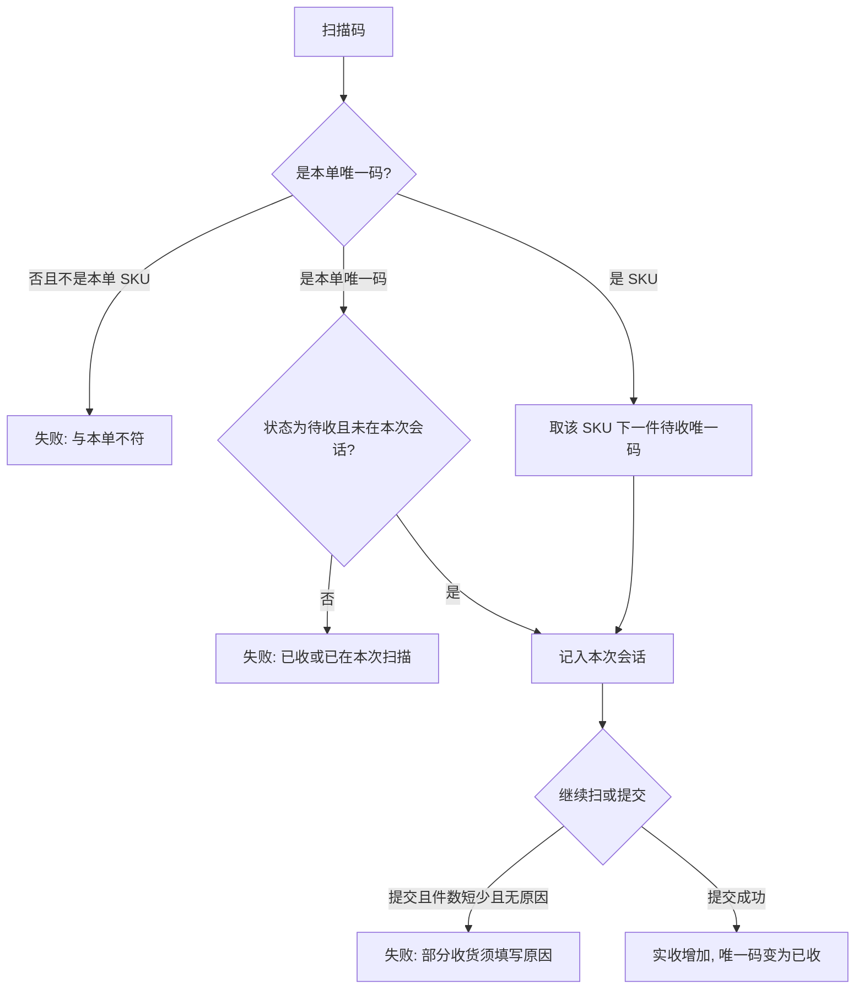

## 4. 状态机

### 4.1 唯一码

一件货从进仓到出仓只走下面这些状态。不合格和仓内维修不能上架。已上架之后不能再改质检结果。

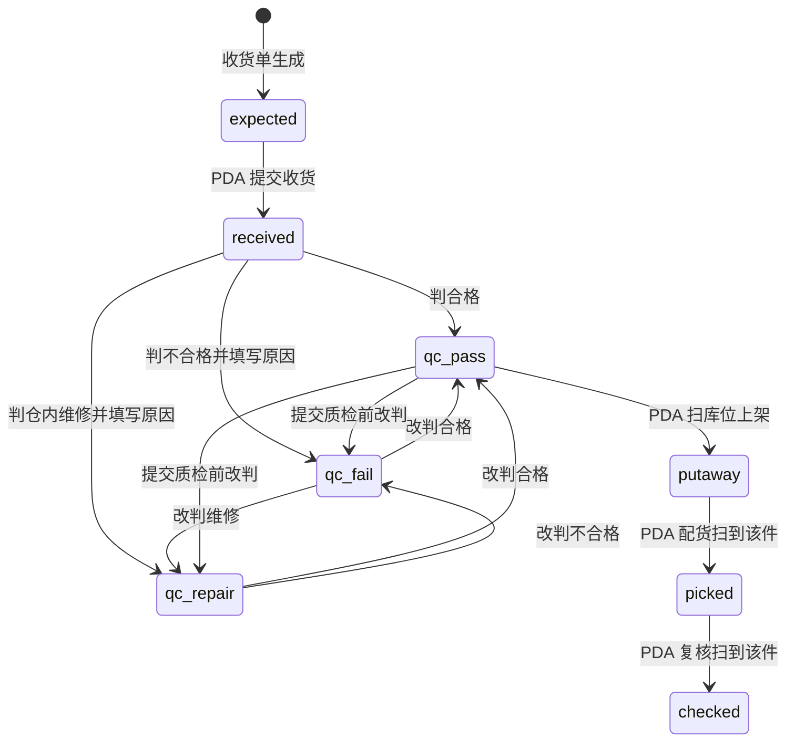

| 状态 | 页面文案 | 允许的下一步 |
| --- | --- | --- |
| expected | 未收 / 待收 | 收货扫描 |
| received | 已收 / 待质检 | 质检 |
| qc_pass | 合格 | 上架，或提交前改判 |
| qc_fail | 不合格 | 改判。不能上架 |
| qc_repair | 仓内维修 | 改判。不能上架 |
| putaway | 已上架 | 配货 |
| picked | 已配货 | 复核 |
| checked | 已复核 | 终态 |

### 4.2 收货单

到货不是一个单独状态，是到货时间有没有值。没有到货时间时，实收必须为 0。

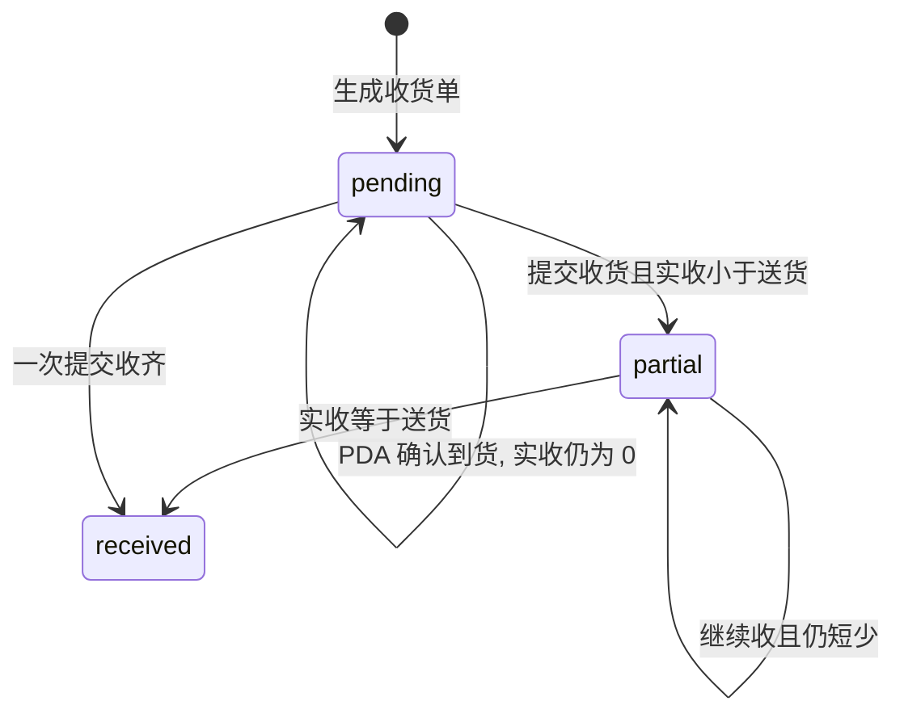

| 状态 | 文案 | 条件 |
| --- | --- | --- |
| pending | 待收货 | 实收 = 0 |
| partial | 部分收货 | 0 < 实收 < 送货，且已填短少原因 |
| received | 全部收货 | 实收 = 送货 |
| void | 作废 | 数据模型保留。当前后台不提供作废按钮 |

### 4.3 入库单

收货提交时如果还没有入库单，就生成一张「待质检」。第一件质检后变为「质检中」。本单已收件数全部质检完并提交后，才变为「质检完成」，同时确认入库并生成上架任务。

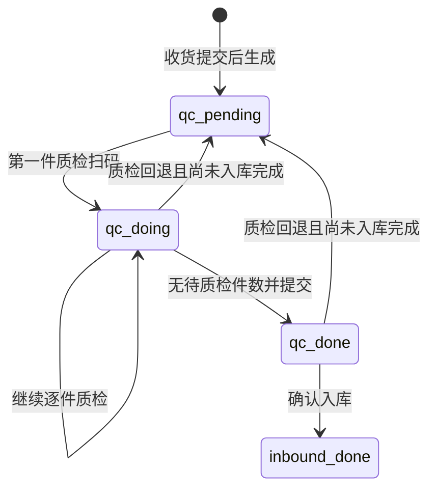

| 状态 | 文案 |
| --- | --- |
| qc_pending | 待质检 |
| qc_doing | 质检中 |
| qc_done | 质检完成 |
| inbound_done | 已入库 |
| void | 作废 |

### 4.4 上架任务

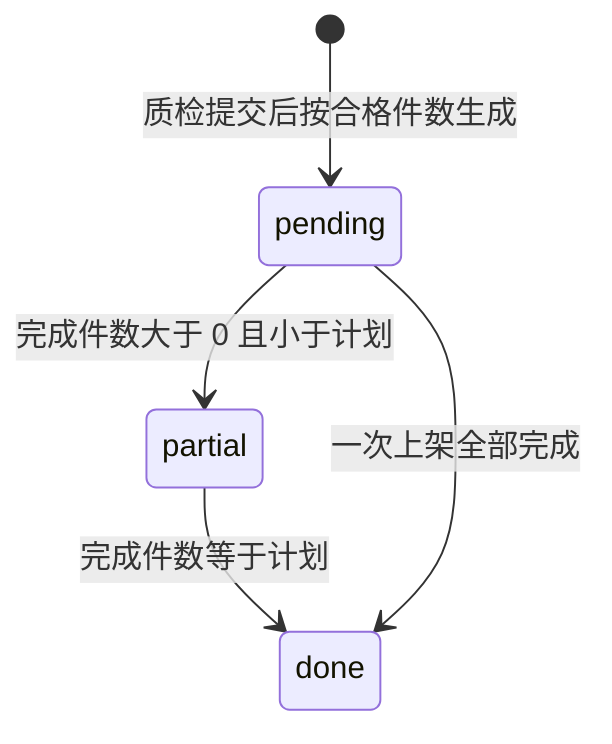

| 状态 | 文案 |
| --- | --- |
| pending | 待上架 |
| partial | 部分上架 |
| done | 已上架 |
| void | 作废 |

### 4.5 出库订单

列表页签按下面的规则归类，不是每个内部状态各占一页。

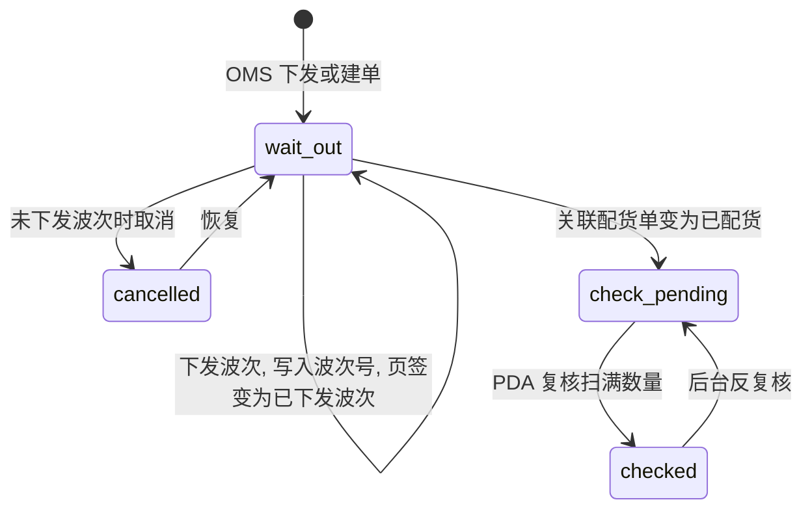

| 页签 | 判定 |
| --- | --- |
| 待下发波次 | 状态为待出库，且没有波次号 |
| 已下发波次 | 状态为待出库，且已有波次号 |
| 待复核 | 状态为待复核 |
| 已复核 | 状态为已复核 |
| 已取消 | 状态为已取消 |

已下发波次的订单不能直接取消。取消波次时，该波次下的配货单改为已取消，订单去掉波次号；若当时已是待复核，则退回待出库。

### 4.6 配货单

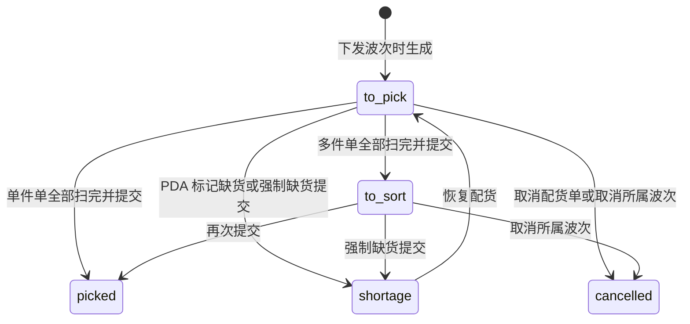

| 状态 | 文案 | 谁来改 |
| --- | --- | --- |
| to_pick | 待配货 | PDA 扫码只增加已拣数量，提交才改状态 |
| to_sort | 待分拣 | 仅多件单 |
| picked | 已配货 | 提交到达此状态时，订单进入待复核 |
| shortage | 缺货 | PDA |
| cancelled | 已取消 | 取消波次或取消配货单 |

后台在「待配货」「待分拣」可以分配配货员。拣货完成不在后台操作。

### 4.7 波次单

波次单管理不分状态页签。下发生成的波次为已下发。取消后为已取消，并取消其配货单。

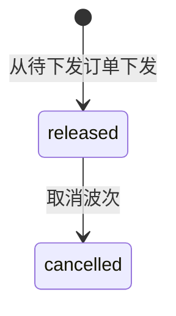

### 4.8 盘点单

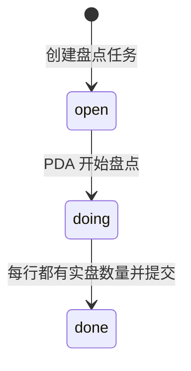

提交时只要还有实盘数量为空的行，就失败。后台另有审核阶段字段：待提交、审核中、已完成、已取消，用于盘点结果差异是否过审。PDA 本次要求的是把实盘数写回去并提交。

### 4.9 移位单

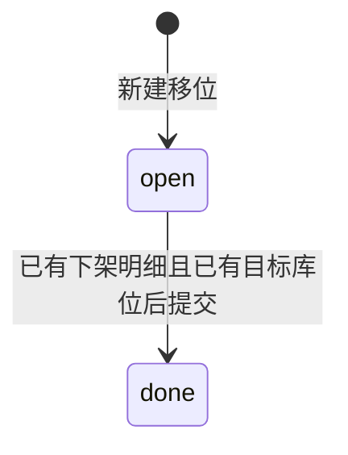

缺明细或缺目标库位时，提交按钮不可用，提交接口失败。

## 5. 编码规则

| 对象 | 规则 | 示例 |
| --- | --- | --- |
| SKU | 站点 \|\| SPU \|\| 色系 \|\| 尺码 | `yours\|\|FUZ1663\|\|DustyLavender\|\|XS` |
| SKC | 站点 \|\| SPU \|\| 色系 | `yours\|\|FUZ1663\|\|DustyLavender` |
| 唯一码 | SKU + `-` + 同一 SKU 从 1 起的序号 | `yours\|\|FUZ1663\|\|DustyLavender\|\|XS-1` |

单号前缀：收货单 `SO`，入库单 `RK`，上架 `SJ`，波次 `BC`，配货 `PH`，出库订单 `CK`，盘点 `ST`，移位 `TL`。

库位来自仓库主数据，形式为 `站点编码-巷道-货位`，例如 `YOURS-01-01`。

## 6. 功能范围

### WMS 后台

| 菜单 | 页面要守住的规则 |
| --- | --- |
| 仓库 / 参数 / 策略 | 仓库、站点、库位供业务页使用 |
| 收货单 | 页签：待收货、部分收货、全部收货。未到货显示「待 PDA 到货」 |
| 入库单 | 页签：待质检、质检中、质检完成、已入库、作废 |
| 上架任务 | 页签：待上架、部分上架、已上架、作废 |
| 订单列表 | 页签：待下发波次、已下发波次、待复核、已复核、已取消 |
| 波次单管理 | 无状态页签 |
| 配货单 | 页签：待配货、待分拣、已配货、缺货、已取消。可分配配货员 |
| 盘点 / 移位 / 操作记录 | 库内结果与操作日志 |
| 库存明细 / 进销存 | 按仓库查看数量 |

### PDA

| 岗位 | 完成动作 |
| --- | --- |
| 到货 | 扫收货单，确认到货 |
| 收货 | 扫唯一码，提交 |
| 质检 | 合格 / 不合格 / 仓内维修，提交 |
| 上架 | 扫唯一码，扫库位，可锁定库位 |
| 配货 | 扫唯一码或 SKU，可标记缺货，提交 |
| 复核 | 扫唯一码，数量达到订单数量即已复核 |
| 盘点 | 先库位后数量，可暂存，行齐全才能提交 |
| 移位 | 扫来源、唯一码、目标库位，提交下架 |
| 异常 | 填写类型、单号、原因并提交 |
| 库位查询 | SKU 看分布；唯一码看库位和状态 |
| 打印唯一码 | 锁定库位后，每扫一次 SKU 生成一个新唯一码 |

列表里的操作一律是按钮。单号、SKU、唯一码、库位等数据点击即复制。

扫码失败时 PDA 用红条显示中文原因。约定的失败码包括：`NOT_FOUND`、`SKU_MISMATCH`、`DUP`、`BIZ`、`SHORT`、`NEED_REASON`、`EMPTY`、`CLOSED`、`PENDING`。

## 7. 技术边界

当前演示是静态页面。WMS 与 PDA 通过浏览器本地存储共用数据，键为 `wms_flow_v9` 与 `wms_org_v1`。页面只通过统一接口访问数据。演示模式不请求服务器。设置里把数据来源改成「对接 WMS」并填写后台根地址后，按 `docs/plans/2026-09-21-wms-pda-api.md` 调用同一套路径。

正式后台还没有部署。因此：

- 换浏览器或换设备，看不到另一台机器上的操作。
- 两台 PDA 同时扫同一唯一码，这一版不能保证只有一台成功。
- 登录账号写在演示数据里，不是正式账号体系。

接口成功与失败的形状固定为：`ok`、`data`、`message`，失败可带 `code`。`message` 直接展示给工人。

## 8. 风险与后续

**现在就能演示的版本**  
GitHub Pages 上的 WMS 与 PDA。验收就是第 1 节的第 1 到第 4 条，在同一浏览器里做完。

**下一版要补的正式能力**

1. 数据库和库存流水，单据状态由流水推出。
2. 登录、租户、仓库隔离。
3. 同一唯一码并发扫码只允许一次成功。
4. WMS 与 PDA 改为调用同一后台，而不是各写各的浏览器存储。

**已知风险**

- 演示存储没有并发控制。两人同时操作会互相覆盖。这是正式上线前必须解决的问题。
- 配货列表展示计划件数，不展示「已拣/应拣」。进度要进 PDA 配货详情看。
- 分拣岗位页面目前是空位，多件单的「待分拣」由再次提交完成，没有独立分拣扫码界面。
